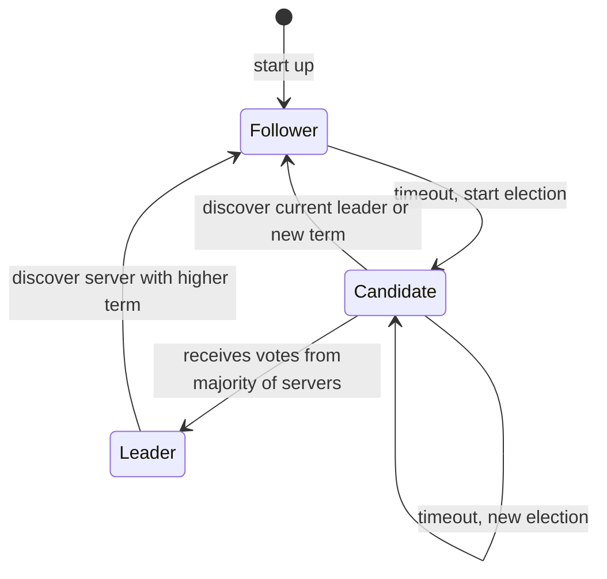
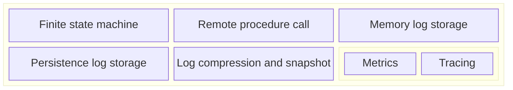
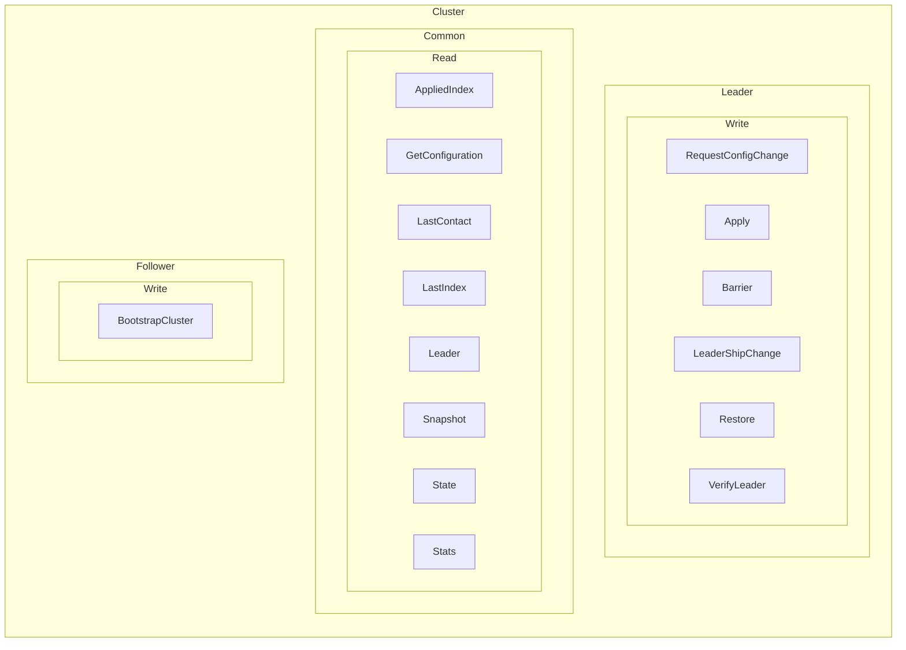

# RAFT consensus implementation

## State machine

## Log entry

Each log entry contain the current term number, a log index and a command

### Command

Each command is abitrary 

## Architecture

